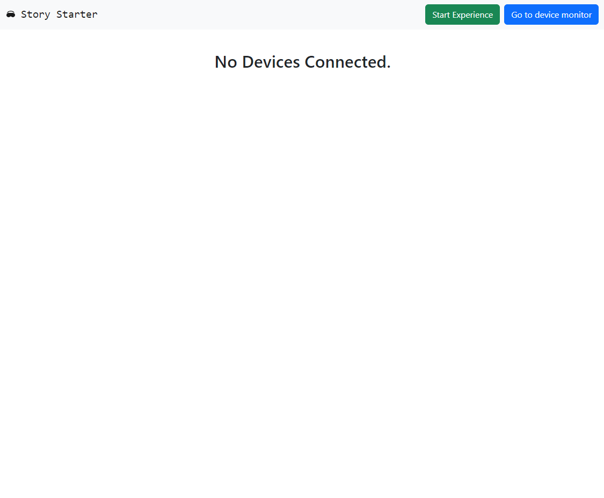
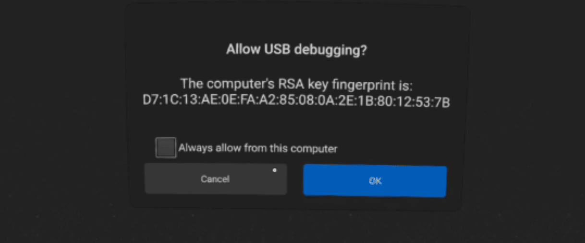

- Starting the server:
  - Plug in the router into power
  - Wait for the 'Wi-Fi' icon to stop blinking
  - Plug in the the server to power
  - Wait for all blinking to stop
  - Then connect your controller device to the router using the Wi-Fi name and password labelled on the server.
  - Use the QR code or link provided to access the Story Starter dashboard
  - It should look like so:
  - 
  -
  -
- Connecting headsets to the server
  - With an Story Linker device:
    - In the headset that you want to connect, connect to the Wi-Fi as above
    - Plug the Story Linker into the headset
    - In the headset, you will see two different prompts
      - The first prompt will say "Allow USB debugging? This computer's RSA key fingerprint is:" and then a long set of characters. Here click the button labelled "Always allow". This may, but not always, prevent these from appearing in future {:height 289, :width 792}
      - The other will say "Allow access to data?". Here click "Allow". This prompt should appear every time. If it does not there may be errors {:height 430, :width 831}
    - Once accepted, the device should appear on the dashboard within 1 minute. If it does not appear, even after refreshing the page, something has gone wrong, check if all prior steps have been followed, or start from the beginning
    - Once the headset appears, disconnect the device from the headset
