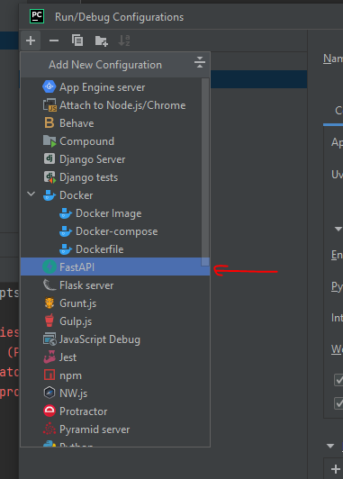

# Simu-Launch

## Install

To run this, you need to install all the dependencies in requirements.txt as follows:

`pip install -r requirements.txt`

In PyCharm 2022.1 there is a dedicated FastAPI Configuration you an use, which fixes some issues we were encountering with port blocking on restart.



## local dev

Run the uvicorn command, which keeps the server running and refreshes it every time there is a change:

`uvicorn main:app --reload`

From then, it all should be working on the interface at <http://127.0.0.1:8000/>

## Production (raspberry pi)

On a raspberry pi, to allow other devices besides the pi accessing the server, run the below. Note that the host 0.0.0.0 allows the server to be accessible to other devices

`uvicorn main:app --reload --port 8000 --host "0.0.0.0"`

Find out the ip address of the raspberry pi, perhaps via this command:

`ifconfig wlan0 | grep inet | awk '{ print $2 }'`

To access the server from other devices, just enter this ip address into your browser

### Auto-loading on device start
note that systemd approach failed to work on pi4

`sudo nano /etc/rc.local`

Save below contents above line 'exit 0' (via Control+s then Control-q to quit). Note ending '&' critical elsewise you cant access your pi again!

```
cd /home/simu-launch
sudo /home/simu-launch/venv/bin/uvicorn main:app --port 8000 --host "0.0.0.0" --app-dir /home/simu-launch &
```

then 
```
sudo reboot
```
note if you are debugging and need to close a port, you can use:
```
lsof -i:8000
```
closing the offending service via its PID via:
```
kill <PID>
```

#StoryLinker
Either burn the existing image or build it from scratch. In terms of the latter, follow this guide to ensure you can USB ssh into your fresh copy of DEBIAN BUSTER (Raspberry PI OS Legacy -- I had issues SSHing into Debian Bullseye, but maybe this works fine) https://www.thepolyglotdeveloper.com/2016/06/connect-raspberry-pi-zero-usb-cable-ssh/. Follow this guide to launch a script at startup (note, important to add '&' at the end of your bash script so you can in the future SSH into your pi) https://www.instructables.com/Raspberry-Pi-Launch-Python-script-on-startup/
